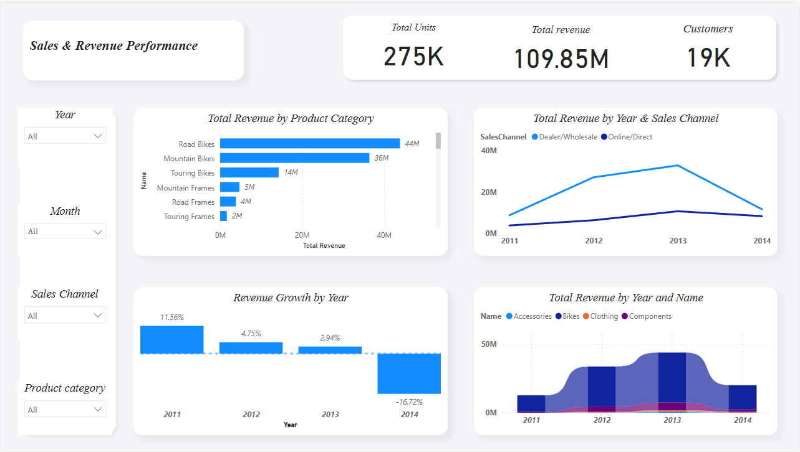
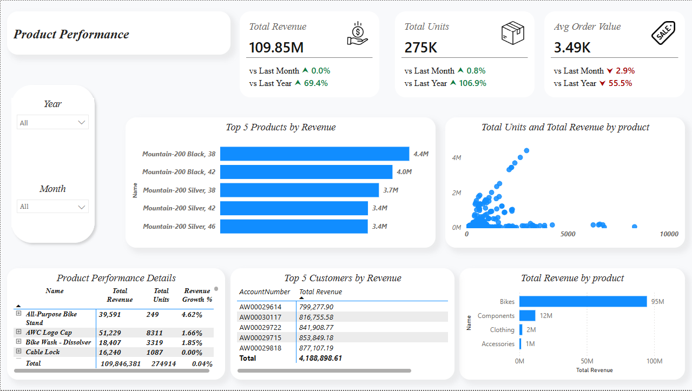

# AdventureWorks Sales Analytics Dashboard
### Built with Power BI · DAX · SQL Server

## Overview
An end-to-end Business Intelligence project analyzing sales performance
for AdventureWorks (2011–2014), covering $109.85M in total revenue across
19K+ customers and 275K+ units sold.

## Tools Used
- SQL Server (AdventureWorks2019)
- Power BI Desktop
- DAX (Data Analysis Expressions)
- Power Query (M Language)

## Data Source
This project uses the AdventureWorks2019 sample database by Microsoft.
Download it from:
https://github.com/Microsoft/sql-server-samples/releases/tag/adventureworks

After downloading, restore it on SQL Server and connect Power BI to it.

## Project Files
| File | Description |
|------|-------------|
| `sales_analytics_dashboard.pbix` | Power BI Dashboard (2 pages) |
| `sales_analysis_report.docx` | Full written analysis report |
| `screenshots/executive_overview.png` | Page 1 preview |
| `screenshots/product_performance.png` | Page 2 preview |

## Dashboard Pages

### Page 1: Executive Overview

### Page 2: Product Performance

## Key DAX Measures
- `Total Revenue` — SUM of all order line totals
- `Total Units` — SUM of quantity sold
- `Unique Customers` — DISTINCTCOUNT of CustomerID
- `Revenue Growth %` — Month-over-Month growth rate
- `Prev Month Revenue` — CALCULATE with DATEADD(-1 Month)

## Key Findings
- 📈 Revenue grew +165% from 2011→2012, peaked at $43.62M in 2013
- 📉 2014 saw a -54% decline driven by Dealer channel volatility
- 🚲 Bikes represent 86.2% of total revenue — high concentration risk
- 🌐 Online/Direct channel at 26.7% — significant growth opportunity
- 🏆 Top product: Mountain-200 Black 38 at $4.4M

## Analysis Report
A full written analysis is included in `sales_analysis_report.docx` covering:
- Root cause analysis of 2014 decline
- SWOT analysis
- 2015–2016 revenue forecasts
- 5 strategic recommendations